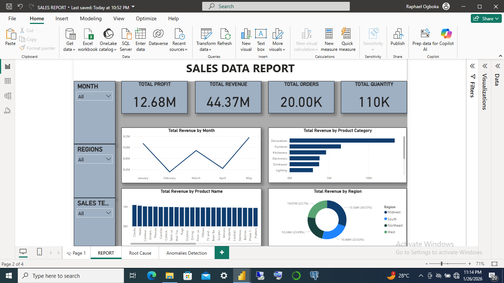
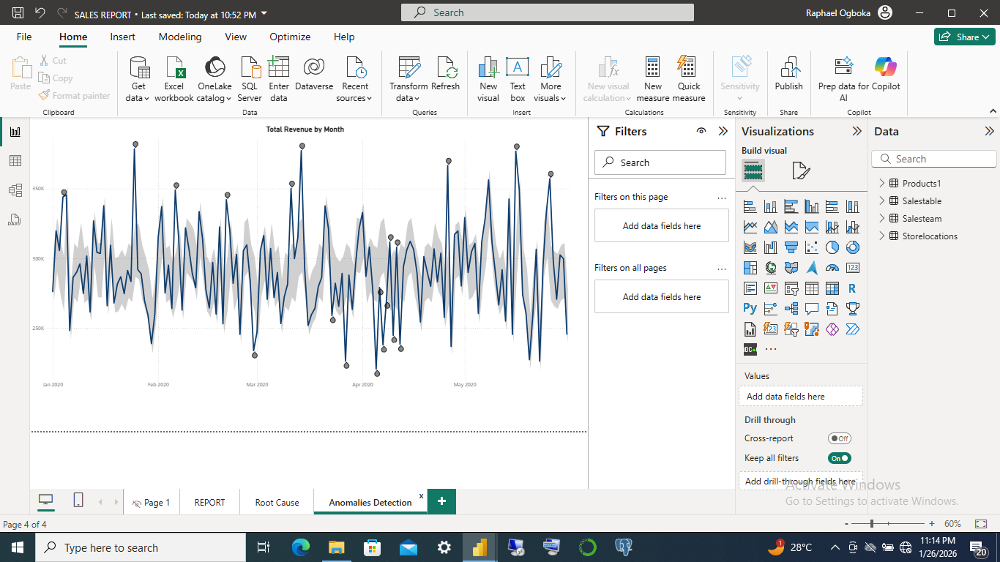

# Sales Performance Analysis (Power BI)

## 📊 Project Overview
This project focuses on analyzing sales performance using **Power BI** to provide actionable business insights.
The dashboard helps stakeholders track revenue trends, evaluate product performance, and identify high-performing regions to support data-driven decision-making.

This project complements my **Excel-based Sales Dashboard** by leveraging Power BI’s advanced data modeling, DAX calculations, and interactive visualizations.

---

## 🛠 Tools & Technologies
- Power BI
- DAX
- Power Query
- Excel (data source)

---

## 📌 Key Business Questions Answered
- How is total sales revenue trending over time?
- Which products and categories generate the highest revenue?
- Which regions and customers contribute most to overall sales?
- How does current performance compare across different time periods?

---

## 📈 Key Insights
- Identified top-performing products driving the majority of revenue.
- Highlighted seasonal trends and peak sales periods.
- Revealed regional performance differences to support targeted sales strategies.
- Enabled quick comparison of sales performance using interactive filters and slicers.

---

## 📂 Project Files
- `Sales_Report.pbix` – Power BI dashboard file
- `Sales_Data.xlsx` – Dataset used for analysis
- `screenshots/` – Dashboard preview images

---

## 🖼 Dashboard Preview

## 🚀 Outcome
The dashboard provides a clear and interactive view of sales performance, allowing business users to quickly identify trends, monitor KPIs, and make informed decisions.
